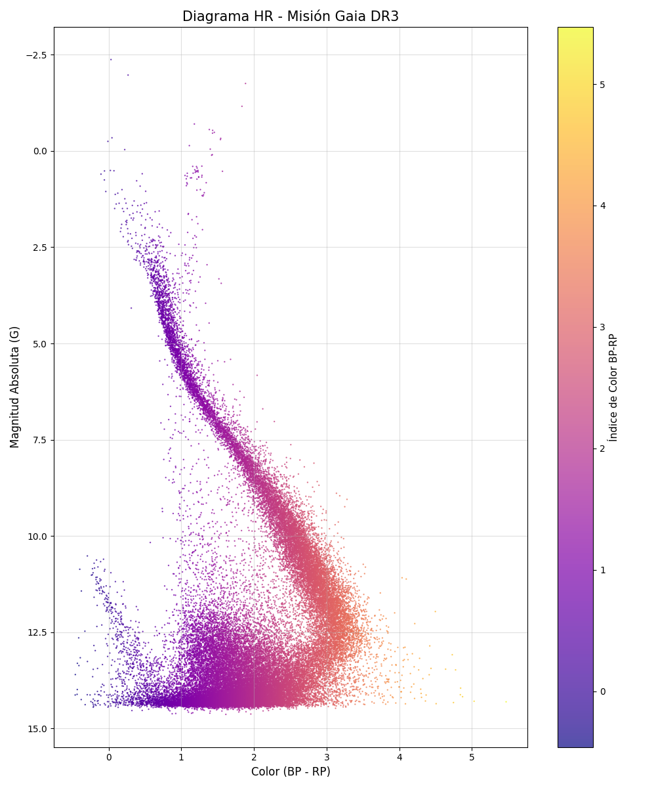

# Proyecto 1 - Sofía Lorena Casallas Beltrán
## Misión Gaia DR3 (Evolución Estelar)

Este repositorio contiene el `pipeline.sh` que automatiza la descarga y el análisis de los datos de la misión Gaia DR3.
Los datos extraídos con `constructor_db.py`, lo cuales fueron filtrados para que no hubieran fuentes con valores Nan y tuvieran siempre paralaje positivo,  se utilizan para realizar los siguientes cálculos:

### Cálculo color:

$$Color = BPmag - RPmag$$

### Cálculo magnitud absoluta:

$$M_{abs} = Gmag + 5 + 5 \log_{10} \left( \frac{Plx}{1000} \right)$$

Con lo obtenido por estas ecuaciones se realiza un segundo filtrado con rangos válidos para estrellas por Gaia como se encuentran documentados en articulos del 2013, donde se asume que valores del color y de la magnitud fuera de estos rangos corresponden a errores de medición y a fuentes muy dificiles de medir y de obtener valores confiables:

* $$-0.5 \leq Color \leq 5.5$$

* $$-5 \leq M_{abs} \leq 20$$

Ya con los datos finales de color y magnitud se realiza la  grafica final del diagrama HR (Color vs Magnitud Absoluta) que se archiva en `resultado.png`

## Problema físico

A partir del diagrama generado, se pueden identificar las siguientes estructuras:

* **Secuencia Principal:** 
Es la diagonal densa que cruza el gráfico, inicia aproximadamente en Mag. Absoluta de 0 hasta 14.
En esta se encuentran las estrellas que están fusionando hidrógeno en helio y que se encuentran en equilibrio hidrostático. Las estrellas masivas se encuentran en la parte superior izquierda con una magintud menor a 2, mientras que las enanas de baja masa se encuentran en le parte inferior derecha con magnitudes superiores a 10; a partir de eto, se resalta la abundancia de estrellas de más bajas masas sobre las de grandes masas.

* **Gigantes Rojas:** 
Se observa unas pocas estrellas que salen de la secuencia principal hacia la esquina superior derecha, en aproximadamente en Mag. Absoluta menores a 4.
Estas estrellas ya han agotado el hidrógeno en su núcleo, entrando así en sus etapas finales de vida. Consecuente a la contracción del núcleo de helio, las capas externas se expanden y se empieza a enfríar, lo que lo mueve a valores de color mayores a 1.5 y a su vez aumentan su luminosidad para ubiarse así encima de la Secuencia Principal con magnitudes menores a 4.
Como se observa en la gráfica, no hay muchas estrellas de este grupo, siendo predominantes las de la Secuencia Principal. 
